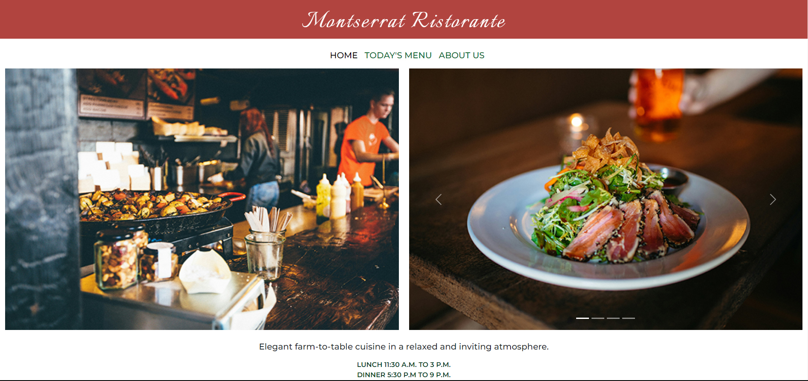
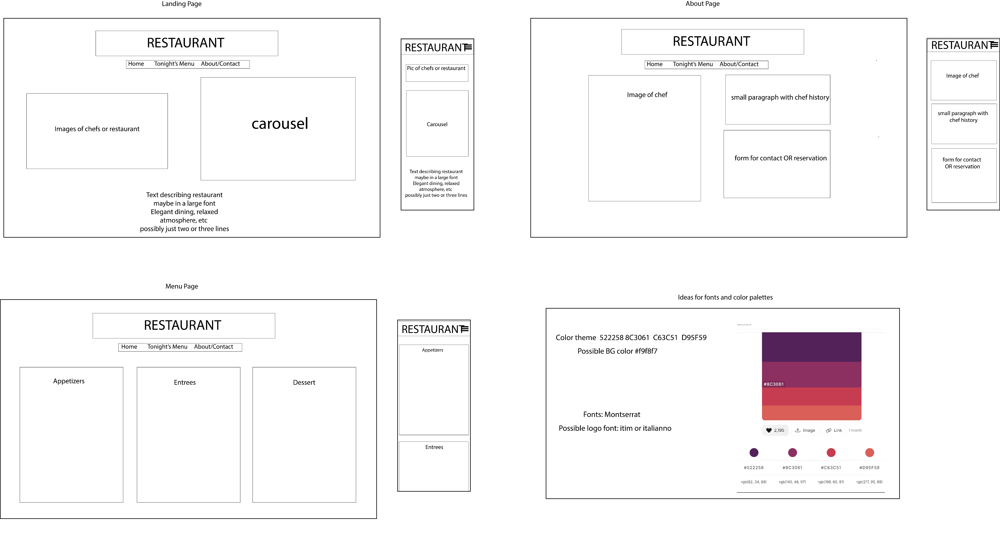

 ## Restaurant Website

This is my first website written from code. As a graphic designer, I have designed many websites, but this is the first time that I've had the opportunity to translate my vision into a reality using code.  

### Overview
This is a basic website highlighting a fictional restaurant. I chose the images first. I wanted to get a theme for the restaurant and match the color palette to the images and the feel of the restaurant. I named it Montserrat Ristorante after the main font that I used for the text. 

### Screenshot

### User stories
 - As a user, I would like to see images of the restaurant and the hours of operation.
 - As a user, I would like to see the menu.
 - As a user, I would like to get background information about the chef and the restaurant. 

### Technologies Used
- HTML5
- CSS
- Bootstrap
- InDesign
- Photoshop

### Wireframe

### Future additions
I would like to add more information and images to the site. I would like to add a form for making a reservation online and a map that would give users directions to the restaurant. 

- Author - Erika Vogt 

